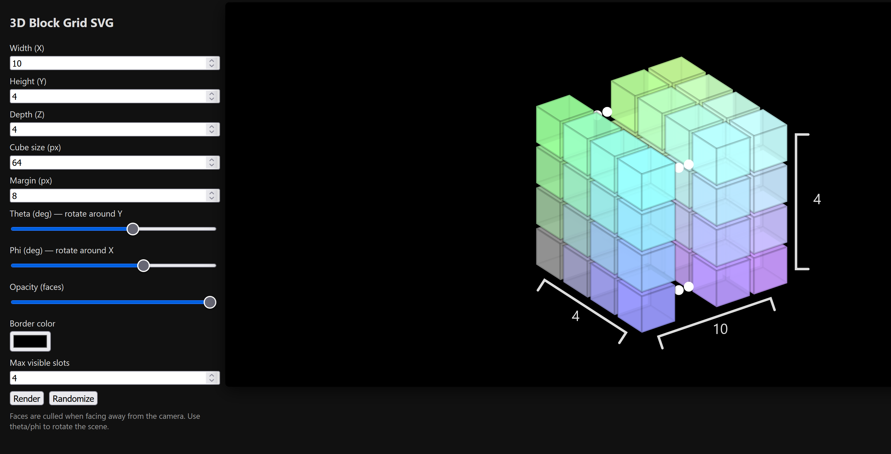

# 3D Block Grid (SVG) — demo

Demo: [Replace with hosted demo URL]

A tiny, single-file orthographic SVG renderer (`main.html`) that visualizes a grid of cubes and draws screen-space brackets for the grid dimensions: Height (Y), Width (X) and Depth (Z).

> Note: this project is intentionally simple and not performance-optimized. It uses naive loops and immediate DOM/SVG updates; for large grids or production use it will be inefficient. It is more or less the result of a "vibe coding session" (This word will be untrendy in 2026). 

## Features

- Interactive controls for Width, Height, Depth, cube size, spacing, rotation (theta/phi), opacity and border color.
- Screen-space brackets that annotate the visual Width, Height and Depth and follow the projected outline of the grid.
- Markers for omitted middle slots when a dimension exceeds `Max visible slots`.

## Controls

- Width (X) — number of columns
- Height (Y) — number of rows / vertical layers
- Depth (Z) — number of depth layers
- Cube size (px) — size of each cube
- Margin (px) — spacing between cubes
- Theta (deg) — rotate around Y (left/right)
- Phi (deg) — rotate around X (up/down)
- Opacity (faces) — cube face opacity
- Border color — stroke color for cube faces
- Max visible slots — maximum visual slots per axis; if a dimension exceeds this the renderer shows markers (two dots) instead of the middle slot.

## Visual helpers

- Brackets are drawn in SVG screen coordinates but anchored to projected cube centers so they appear attached to the visible edges of the grid.
- The width bracket picks a representative Y and Z layer depending on phi/theta to attach to the visually outer column and places the bracket outward along the perpendicular screen vector.
- The depth bracket samples an X and Y layer (based on theta/phi) and draws a bracket between the front-most (z=0) and back-most (z=visD-1) projected centers, labeling it with the real `D` value.
- When a dimension is larger than `Max visible slots` the renderer uses `visW/visH/visD` for visual layout and shows a marker (two dots) in the middle slot to indicate omitted cells.

## Implementation notes

- Uses vanilla JavaScript and SVG with a simple orthographic projection (no perspective).
- Input angles are provided in degrees and converted to radians via `deg()`/`rad()` helpers.
- The rendering pipeline is immediate: world coords -> rotate -> project -> append SVG elements. This is simple but not optimized for large scenes.

## Portability

- The code is framework-agnostic and easy to adapt to React, Vue or other frameworks by moving rendering into components and managing input state.

## Troubleshooting

- If labels or strokes are hard to see, adjust `Border color` or increase `Cube size`.
- If a bracket is not where you expect, try changing `Theta`/`Phi` — bracket anchor selection depends on those angles.

## Customizing

- To change which cube column/row is used to anchor a bracket, edit the bracket IIFEs near the end of `test.html`:
    - `drawHeightBracket` chooses a reference projected X column.
    - `drawWidthBracket` chooses a Y/Z layer.
    - `drawDepthBracket` chooses an X/Y layer.

## Examples

- Live example: replace the demo URL above with your hosted `test.html` link.
- Replace the screenshot placeholder with a screenshot showing the grid.

## License

Use freely for prototypes and demos.

- To change which cube column/row is used to anchor a bracket, edit the bracket IIFE near the end of `test.html`:
    - `drawHeightBracket` chooses a reference projected X column.
    - `drawWidthBracket` chooses a Y/Z layer.
    - `drawDepthBracket` chooses an X/Y layer (added in the file).

License

Use freely for prototypes and demos.
